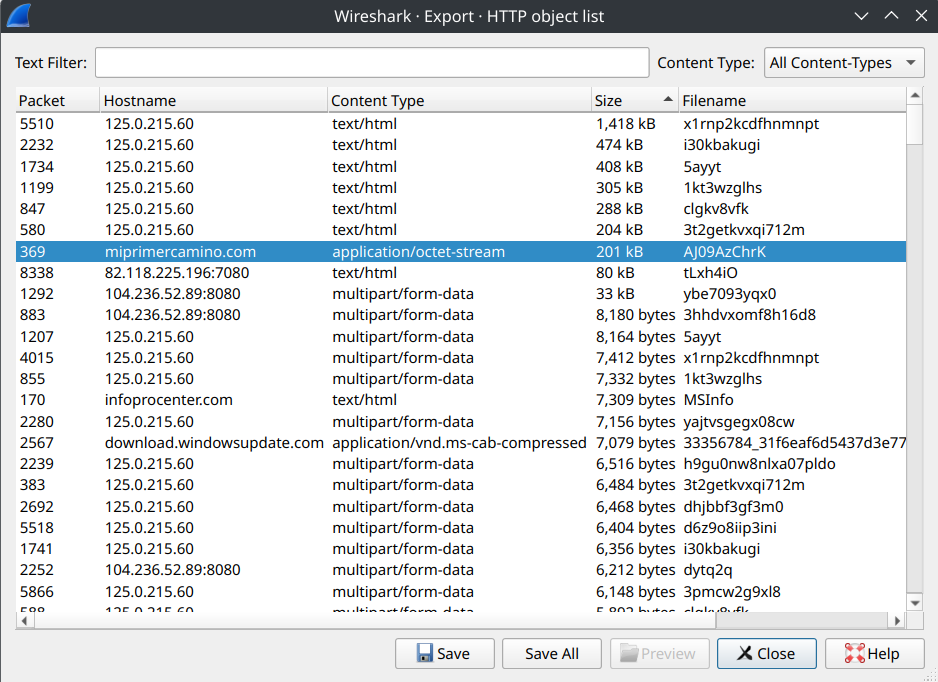

## Useful Resources
* Database of Bad URLs: https://urlhaus.abuse.ch/

## Reminders
* Check odd HTTP/HTTPs Ports that are set as destinations. If we are using SSL/TLS to connect to 8080, 9443, etc. This could be suspicious.
## Customization of Display and Filtering

### Useful Filters
* `http.request or tls.handshake.type eq 1`: Shows HTTP requests and HTTPs requests that contain domain names.
* `(http.request or tls.handshake.type eq 1) and !(ssdp)`: Apparently Windows Simple Service Discovery can be quite noisy and may be ommitted.
* `(http.request or tls.handshake.type eq 1 or (tcp.flags.syn eq 1 and tcp.flags.ack eq 0)) and !(ssdp)`: Includ`e additional initial connections that are not just HTTP and HTTPs connections.
* `(http.request or tls.handshake.type eq 1 or (tcp.flags.syn eq 1 and tcp.flags.ack eq 0) or dns) and !(ssdp)`: Includ`e additional initial connections that are not just HTTP and HTTPs connections. Also include DNS
* `ftp.request.command or (ftp-data and tcp.seq eq 1)`: FTP
* `smtp or dns`:  Shows SMTP or DNS traffic (Shows likely attempted connections)
* `smtp.req.command`: Shows SMTP Connections.
* `smtp.data.fragment`: May allows us to see unencrypted traffic.
* `tcp.analysis.retransmission and tcp.flags eq 0x0002`: This allows us to view 'failed' or incomplete TCP connections (SYN sent but re transmitted)
* `tls.handshake.type eq 11 and !(x509sat.CountryName == US)`: Examine traffic for any certificates that are not issues (or said to be issued) from the US.
* `not (http.host contains microsoft or tls.handshake.extensions_server_name contains microsoft )`: Examine non-Microsoft traffic

>[!NOTE]
>These filters can be saved and quickly selected from a dropdown rather than having to type or copy paste them each time.

> [!IMPORTANT]
> Remember to use `follow` with Wireshark to more coherently observe the packet flows (TCP).

We can use the `contains` operator to supply a match string that will filter for a field that contains the specified string. For example `ip contains "DESKTOP-"` will match any ip packets that contain the string  "DESKTOP-".

You can use `EDIT->Find Packet` for a more robust search. You would need to selcect Packet Details and String.
## Identifying Hosts

There are three identifiers that can be examined when looking at network traffic to identify the *host* something originates from.
* **MAC Address**: Associated with the Physical Network Interface Card.
* **IP Address**: Associated with specific machines for network based routing (One NIC may have multiple IPs (though not always))
* **Hostname**: This is a self-set name associated with the computer

**DHCP Traffic**
This is useful for finding hosts on the network, as this allows us to identify the *hostname* associated with an IP address as this is often included in the request.

> [!NOTE]
> Use the search filter `dhcp` to filter for this traffic

**NBNS ([Net Bios Name Service](https://wiki.wireshark.org/NetBIOS/NBNS))**
This is a protocol used by older Windows systems and some apply products. This is similar to DNS but used in a local network to resolve hostnames, this only works for IPv4 and is not hierarchical like DNS.

This can allow us to view a IP to hostname mapping

> [!NOTE]
> Use the search filter `nbns` to filter for this traffic

**Device Model and OS Type**
If there is unencrypted HTTP traffic this can allow us to determine the Model and OS Types. This is because of the User-Agent string in the request> 

> [!WARNING]
> Programs are able to spoof the information contained in a User-Agent. There has also been an attempt at reducing the amount of infomation contained in the user-agent strings so this may be of limited use.


To find unencrypted traffic we can filter on `http.accept_language` which find the `Accept-Language` 

| **Windows NT version** | **Windows OS Version**   |
| ---------------------- | ------------------------ |
| Windows NT 5.1         | Windows XP               |
| Windows NT 6.0         | Windows Vista            |
| Windows NT 6.1         | Windows 7                |
| Windows NT 6.2         | Windows 8                |
| Windows NT 6.3         | Windows 8.1              |
| Windows NT 10.0        | Windows 10 or Windows 11 |
**Kerberos Enviornment**
Windows systems often operate joined to a domain managed by Active Directory. Where Kerberos communications will often occur and can be used to identify the host systems.

> [!NOTE]
> We can use the filter `kerberos.CNameString` to filter on CNameStrings in kerberos communications.

> [!IMPORTANT]
> You can use Right-Click apply as Column in the packet disection to add the CNameStrings to the display.

**LDAP**
LDAP may also be used, we can do a similar name for identifying users with the query `ldap contains "CN=Users"` and we can again apply this as a column.

## Export Objects
It may be the case that we find a file being downloaded or uploaded over the network when we have performed a traffic capture. This can be from a HTTP GET request, SMTP message or even FTP. In the event we find a file of interest we can use Wireshark to reconstruct the file from the packets so we can analyze it (most likely upload to a sandbox).

We can select File -> Export Object -> Type (HTTP, SMTP, etc) -> Stream Object

> [!NOTE]
> For HTTP GET requests we would not be looking for the file name that is downloaded from the get requests, but we would be looking for the pathname. That is if we have  the following
> 
> ```
> GET /cgi-bin/AJ09AzChrK/ HTTP/1.1
Host: miprimercamino.com
Connection: Keep-Alive
HTTP/1.1 200 OK
Date: Tue, 05 Jan 2021 19:48:49 GMT
Server: Apache
Cache-Control: no-cache, must-revalidate
Pragma: no-cache
Expires: Tue, 05 Jan 2021 19:48:49 GMT
Content-Disposition: attachment; filename="GP0YDWjjyouW.dll"
> ```
> We would not be searching for `GP0YDWjjyouW.dll`, but instead would be searching for `AJ09AzChrK` as this is the final chunk of the GET request.



## Resources

* https://unit42.paloaltonetworks.com/unit42-customizing-wireshark-changing-column-display/
* https://unit42.paloaltonetworks.com/using-wireshark-display-filter-expressions/


